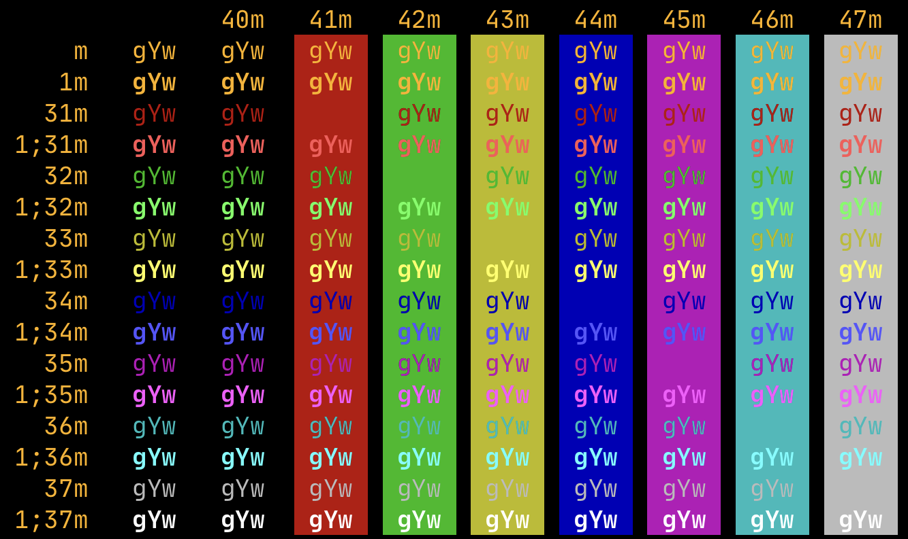

# [Blink Shell](http://www.blink.sh) Themes

To install them on Blink, just paste the URL of the JS theme under Appearance -> Themes -> New Theme. If you would like to learn how to create your own, [look here](https://github.com/blinksh/blink/blob/raw/Resources/FontsAndThemes.md).

You can also find about [Blink's official repository](https://github.com/blinksh/blink)

## Screenshots

### [Microterm](themes/Microterm.js)
Amber on black theme reminiscent of the Microterm RS232 terminals I used in the 1990s, but with colors.

